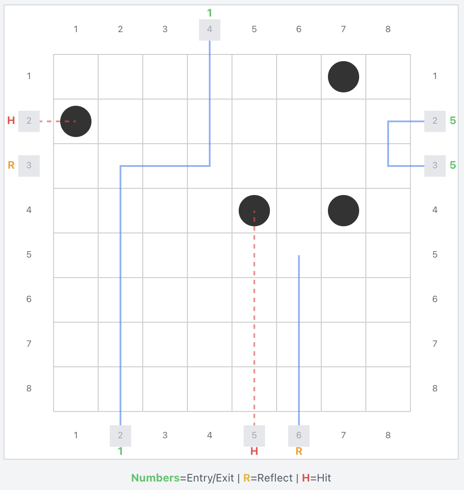

```{r}
#| label: setup
#| include: false

library(tidyverse)
library(jsonlite)
library(knitr)
library(kableExtra)
library(scales)

# Order model names by family (Haiku < Sonnet < Opus), then version
order_model_names <- function(names) {
  family_rank <- c("Haiku" = 1, "Sonnet" = 2, "Opus" = 3)
  unique_names <- unique(na.omit(names))
  parts <- strsplit(unique_names, " ")
  families <- sapply(parts, `[`, 1)
  versions <- as.numeric(sapply(parts, `[`, 2))
  unique_names[order(family_rank[families], versions)]
}

# Presentation theme defaults
theme_set(theme_minimal(base_size = 18))
theme_update(
  panel.grid.minor = element_blank(),
  legend.position = "top",
  plot.title = element_text(size = 22, face = "bold"),
  plot.subtitle = element_text(size = 16, color = "grey40"),
  strip.text = element_text(size = 16, face = "bold")
)

# Model color palette (5 models)
model_colors <- c(
  "Haiku 4.5" = "#e74c3c",
  "Sonnet 4.5" = "#3498db",
  "Sonnet 4.6" = "#2ecc71",
  "Opus 4.5" = "#f39c12",
  "Opus 4.6" = "#9b59b6"
)
```

```{r}
#| label: load-all-data
#| include: false

# ── Predict Data ──────────────────────────────────────────────
predict_json_files <- list.files(
  path = "Experiment 1/Predict",
  pattern = "\\.json$",
  full.names = TRUE
)

# R port of traceRay() from blackbox.jsx — computes the full ray path
trace_ray_r <- function(atom_config, entry_side, entry_pos) {
  GRID_SIZE <- 8
  atom_set <- paste(atom_config[, 1], atom_config[, 2], sep = ",")
  has_atom <- function(r, c) paste(r, c, sep = ",") %in% atom_set

  if (entry_side == "north") { row <- 0; col <- entry_pos; dr <- 1;  dc <- 0  }
  else if (entry_side == "south") { row <- 9; col <- entry_pos; dr <- -1; dc <- 0  }
  else if (entry_side == "west")  { row <- entry_pos; col <- 0; dr <- 0;  dc <- 1  }
  else { row <- entry_pos; col <- 9; dr <- 0; dc <- -1 }

  entry_row <- row + dr
  entry_col <- col + dc

  get_diags <- function(r, c, vr, vc) {
    if (vr ==  1) list(left = c(r+1, c+1), right = c(r+1, c-1))
    else if (vr == -1) list(left = c(r-1, c-1), right = c(r-1, c+1))
    else if (vc ==  1) list(left = c(r-1, c+1), right = c(r+1, c+1))
    else                list(left = c(r+1, c-1), right = c(r-1, c-1))
  }

  if (has_atom(entry_row, entry_col)) {
    return(list(path = matrix(c(entry_row, entry_col), ncol = 2),
                absorbed = TRUE, reflected = FALSE))
  }
  init_diags <- get_diags(row, col, dr, dc)
  if (has_atom(init_diags$left[1], init_diags$left[2]) ||
      has_atom(init_diags$right[1], init_diags$right[2])) {
    return(list(path = matrix(nrow = 0, ncol = 2),
                entry_cell = c(entry_row, entry_col),
                absorbed = FALSE, reflected = TRUE))
  }

  path_rows <- integer(0); path_cols <- integer(0)
  for (step in seq_len(100)) {
    row <- row + dr; col <- col + dc
    if (row < 1 || row > GRID_SIZE || col < 1 || col > GRID_SIZE) {
      path_mat <- if (length(path_rows) > 0) matrix(c(path_rows, path_cols), ncol = 2)
                  else matrix(nrow = 0, ncol = 2)
      if (row < 1) { exit_side <- "north"; exit_pos <- col }
      else if (row > GRID_SIZE) { exit_side <- "south"; exit_pos <- col }
      else if (col < 1) { exit_side <- "west"; exit_pos <- row }
      else { exit_side <- "east"; exit_pos <- row }
      is_reflect <- (exit_side == entry_side && exit_pos == entry_pos)
      return(list(path = path_mat, absorbed = FALSE, reflected = is_reflect))
    }
    path_rows <- c(path_rows, row); path_cols <- c(path_cols, col)
    if (has_atom(row, col))
      return(list(path = matrix(c(path_rows, path_cols), ncol = 2),
                  absorbed = TRUE, reflected = FALSE))
    ahead_r <- row + dr; ahead_c <- col + dc
    if (!has_atom(ahead_r, ahead_c)) {
      diags <- get_diags(row, col, dr, dc)
      left_atom  <- has_atom(diags$left[1], diags$left[2])
      right_atom <- has_atom(diags$right[1], diags$right[2])
      if (left_atom && right_atom) { dr <- -dr; dc <- -dc }
      else if (left_atom) { tmp <- dr; dr <- dc; dc <- -tmp }
      else if (right_atom) { tmp <- dr; dr <- -dc; dc <- tmp }
    }
  }
  path_mat <- if (length(path_rows) > 0) matrix(c(path_rows, path_cols), ncol = 2)
              else matrix(nrow = 0, ncol = 2)
  list(path = path_mat, absorbed = TRUE, reflected = FALSE)
}

count_ray_cells <- function(atom_config, entry_side, entry_pos) {
  nrow(trace_ray_r(atom_config, entry_side, entry_pos)$path)
}

count_atoms_affecting <- function(atom_config, entry_side, entry_pos) {
  result <- trace_ray_r(atom_config, entry_side, entry_pos)
  path <- result$path
  if (nrow(path) == 0 && !is.null(result$entry_cell)) {
    ec <- result$entry_cell
    affected <- 0L
    for (i in seq_len(nrow(atom_config))) {
      if (abs(atom_config[i, 1] - ec[1]) <= 1 &&
          abs(atom_config[i, 2] - ec[2]) <= 1) affected <- affected + 1L
    }
    return(affected)
  }
  if (nrow(path) == 0) return(0L)
  affected <- 0L
  for (i in seq_len(nrow(atom_config))) {
    atom_row <- atom_config[i, 1]; atom_col <- atom_config[i, 2]
    for (j in seq_len(nrow(path))) {
      if (abs(atom_row - path[j, 1]) <= 1 && abs(atom_col - path[j, 2]) <= 1) {
        affected <- affected + 1L; break
      }
    }
  }
  affected
}

extract_predict_results <- function(json_file) {
  data <- jsonlite::fromJSON(json_file, simplifyDataFrame = FALSE)
  results <- data$results
  map_dfr(results, function(r) {
    predictions <- r$predictions
    if (is.null(predictions) || length(predictions) == 0) return(tibble())
    map_dfr(predictions, function(p) {
      cells_traveled <- count_ray_cells(r$atomConfig, p$rayEntry$side, p$rayEntry$pos)
      atoms_affecting <- count_atoms_affecting(r$atomConfig, p$rayEntry$side, p$rayEntry$pos)
      tibble(
        model_name = r$modelName,
        prompt_style = r$promptStyle,
        config_index = r$configIndex,
        enable_thinking = r$enableThinking,
        vot_ray_trace = r$votRayTrace,
        correct = p$correct,
        cells_traveled = cells_traveled,
        atoms_affecting = atoms_affecting
      )
    })
  })
}

predict_data <- map_dfr(predict_json_files, extract_predict_results)

# ── Play Data ─────────────────────────────────────────────────
play_json_files <- list.files(
  path = "Experiment 1/Play",
  pattern = "\\.json$",
  full.names = TRUE
)

extract_play_results <- function(json_file) {
  data <- jsonlite::fromJSON(json_file, simplifyDataFrame = FALSE)
  results <- data$results
  map_dfr(results, function(r) {
    ray_complexity <- lapply(r$raySequence, function(ray) {
      if (!is.null(ray$action) && ray$action == "fire" &&
          !is.null(ray$rayEntry)) {
        list(
          atoms = count_atoms_affecting(r$atomConfig, ray$rayEntry$side, ray$rayEntry$pos),
          cells = count_ray_cells(r$atomConfig, ray$rayEntry$side, ray$rayEntry$pos)
        )
      } else {
        list(atoms = NA_real_, cells = NA_real_)
      }
    })
    mean_atoms <- mean(sapply(ray_complexity, function(x) x$atoms), na.rm = TRUE)
    mean_cells <- mean(sapply(ray_complexity, function(x) x$cells), na.rm = TRUE)
    if (is.nan(mean_atoms)) mean_atoms <- NA_real_
    if (is.nan(mean_cells)) mean_cells <- NA_real_

    tibble(
      model_name = r$modelName,
      prompt_style = r$promptStyle,
      config_index = r$configIndex,
      enable_thinking = r$enableThinking,
      vot_grid_state = r$votGridState,
      vot_ray_trace = r$votRayTrace,
      vot_hypothesis = r$votHypothesis,
      rays_used = r$raysUsed,
      atoms_correct = r$atomsCorrect,
      score = r$score,
      mean_atoms_per_ray = mean_atoms,
      mean_cells_per_ray = mean_cells
    )
  })
}

play_data <- map_dfr(play_json_files, extract_play_results)

play_data <- play_data |>
  mutate(
    source = "original",
    run_id = "original",
    vot_condition = case_when(
      vot_grid_state ~ "A: Grid State",
      vot_ray_trace ~ "B: Ray Trace",
      vot_hypothesis ~ "C: Hypothesis",
      TRUE ~ "None"
    ),
    vot_condition = factor(vot_condition, levels = c("None", "A: Grid State", "B: Ray Trace", "C: Hypothesis"))
  )

# ── Replication Data ──────────────────────────────────────────
replication_dir <- "Experiment 3 Multiple Runs Top Leaders"
replication_json_files <- if (dir.exists(replication_dir)) {
  list.files(path = replication_dir, pattern = "\\.json$", full.names = TRUE)
} else {
  character(0)
}

if (length(replication_json_files) > 0) {
  replication_data <- map_dfr(replication_json_files, function(f) {
    run_id <- stringr::str_extract(basename(f), "\\d{4}-\\d{2}-\\d{2}T\\d{2}-\\d{2}-\\d{2}")
    extract_play_results(f) |>
      mutate(source = "replication", run_id = run_id)
  })

  replication_data <- replication_data |>
    mutate(
      vot_condition = case_when(
        vot_grid_state ~ "A: Grid State",
        vot_ray_trace ~ "B: Ray Trace",
        vot_hypothesis ~ "C: Hypothesis",
        TRUE ~ "None"
      ),
      vot_condition = factor(vot_condition, levels = c("None", "A: Grid State", "B: Ray Trace", "C: Hypothesis"))
    )

  play_data_original <- play_data
  play_data <- bind_rows(play_data, replication_data)

  n_replication_runs <- length(replication_json_files)

  replicated_conditions <- replication_data |>
    distinct(model_name, prompt_style, enable_thinking, vot_grid_state, vot_ray_trace, vot_hypothesis)
} else {
  play_data_original <- play_data
  n_replication_runs <- 0
  replicated_conditions <- tibble()
}

# ── Optimal Solver ────────────────────────────────────────────
optimal_json_path <- "optimal_solver_results.json"
has_optimal <- file.exists(optimal_json_path)

if (has_optimal) {
  optimal_raw <- fromJSON(optimal_json_path)
  optimal_data <- tibble(
    config_index = optimal_raw$configs$config_index,
    optimal_rays = optimal_raw$configs$optimal_rays,
    optimal_ray_points = optimal_raw$configs$score$ray_points,
    optimal_score = optimal_raw$configs$score$total,
    optimal_solved = optimal_raw$configs$solved
  )
}

# ── Error Classifications ─────────────────────────────────────
error_class_file <- "error_classifications.json"
has_error_classifications <- file.exists(error_class_file)

if (has_error_classifications) {
  error_data <- jsonlite::fromJSON(error_class_file)

  has_predict_errors <- !is.null(error_data$predict) && length(error_data$predict) > 0
  if (has_predict_errors) {
    predict_errors <- as_tibble(error_data$predict) |>
      mutate(model_name = model)
  }

  has_play_errors <- !is.null(error_data$play) && length(error_data$play) > 0
  if (has_play_errors) {
    play_errors <- as_tibble(error_data$play) |>
      mutate(
        error_label = case_when(
          primary_failure_mode == "ray_path_error" ~ "Ray path error",
          primary_failure_mode == "deflection_geometry_error" ~ "Deflection geometry error",
          primary_failure_mode == "constraint_tracking_error" ~ "Constraint tracking error",
          primary_failure_mode == "experiment_design_error" ~ "Experiment design error",
          primary_failure_mode == "belief_updating_error" ~ "Belief updating error",
          primary_failure_mode == "premature_commitment" ~ "Premature commitment",
          TRUE ~ primary_failure_mode
        ),
        error_domain = ifelse(is_spatial, "Spatial", "Non-spatial"),
        model_name = model
      )
  }
}

# ── Deterministic Play Analysis ───────────────────────────────
det_analysis_files <- if (file.exists("experiment1_play_combined_analysis.json")) {
  "experiment1_play_combined_analysis.json"
} else {
  Sys.glob("*_analysis.json")
}
has_det_play <- length(det_analysis_files) > 0

if (has_det_play) {
  det_all_games <- list()
  det_all_rays <- list()

  for (f in det_analysis_files) {
    raw <- jsonlite::fromJSON(f, simplifyDataFrame = FALSE)
    for (game in raw$games) {
      s <- game$summary
      game_row <- tibble(
        model_name = game$model_name %||% NA_character_,
        config_index = game$config_index %||% NA_integer_,
        prompt_style = game$prompt_style %||% NA_character_,
        enable_thinking = game$enable_thinking %||% FALSE,
        total_rays_fired = s$total_rays_fired %||% NA_integer_,
        n_optimal_rays = s$n_optimal_rays %||% NA_integer_,
        n_suboptimal_rays = s$n_suboptimal_rays %||% NA_integer_,
        mean_ray_rank = s$mean_ray_rank %||% NA_real_,
        uniquely_identified_at_ray = s$uniquely_identified_at_ray %||% NA_integer_,
        excess_rays = s$excess_rays %||% NA_integer_,
        n_marks = s$n_marks %||% NA_integer_,
        n_inconsistent_marks = s$n_inconsistent_marks %||% NA_integer_,
        guess_in_candidates = s$guess_in_candidates %||% NA,
        atoms_correct = s$atoms_correct %||% NA_integer_,
        game_score = s$game_score %||% NA_real_,
        optimal_solver_rays = s$optimal_solver_rays %||% NA_integer_
      )
      det_all_games <- c(det_all_games, list(game_row))

      game_id <- paste0(game$model_name, "_", game$config_index)
      for (ray in game$ray_analysis) {
        ray_row <- tibble(
          game_id = game_id,
          model_name = game$model_name %||% NA_character_,
          ray_number = ray$ray_number,
          is_excess = ray$is_excess,
          llm_rank = ray$llm_rank %||% NA_integer_,
          is_optimal = ray$is_optimal
        )
        det_all_rays <- c(det_all_rays, list(ray_row))
      }
    }
  }

  det_games <- bind_rows(det_all_games)
  det_rays <- bind_rows(det_all_rays)
}

# ── Chance Baseline ───────────────────────────────────────────
chance_pmf <- tibble(
  k = 0:4,
  prob = dhyper(k, 4, 60, 4),
  missed = 4 - k,
  score = 5 * missed
)
chance_EX <- sum(chance_pmf$k * chance_pmf$prob)
chance_Escore <- sum(chance_pmf$score * chance_pmf$prob)
```

## Follow Along {style="text-align: center;"}

:::: {.columns}
::: {.column width="50%"}
<br><br>

### View these slides online:

<h3><a href="https://tjohnson250.github.io/BBXReact/blackbox_presentation.html">tjohnson250.github.io/BBXReact</a></h3>

:::

::: {.column width="50%"}

{fig-align="center" width="450"}

:::
::::

## Clinical Reasoning at Scale

LLMs are being deployed across clinical reasoning tasks at unprecedented speed.

::: {.incremental}
-   **In 2024, 31.5% of 2,174 US hospitals** deployed generative AI in clinical workflows; another **24.7% planned near-term adoption** [@everson2025genai]

-   **2024 survey with responses from 43 of 67 Scottsdale Institute health systems** all reported active AI adoption in clinical documentation (ambient listening at 100%) [@poon2025]

-   **1 (2019) → 557 (2024) papers/year** evaluating LLMs in clinical medicine  [@shool2025systematic]
:::

::: {.fragment}
**Scope of deployment:** Triage · Differential diagnosis · Clinical documentation · Test ordering · Referral decisions · Prior authorization · Coding · Treatment planning
:::

::: notes
I want to start with the scope of what's happening. A third of US hospitals are already running generative AI in clinical workflows. A national survey of leading health systems found universal adoption activity. The research literature has more than tripled in a single year. And the applications span the full range of clinical cognitive work — not just documentation, which is relatively low-risk, but diagnosis, triage, test ordering, treatment planning. Tasks that require clinical reasoning. The question is: what's the evidentiary basis for this deployment?
:::

## The Case for Deployment

:::::: columns
:::: {.column width="48%"}
### Benchmark Milestones

::: {.incremental}
-   **GPT-4: \~86% on USMLE-style questions**, exceeding passing threshold by 20+ points [@garabet2024gpt4usmle]

-   **Med-PaLM 2: Scored 86.5% on MedQA (USMLE-Style)**. [@singhal2025toward]
    - **Physicians preferred Med-PaLM 2 answers** over generalist physician answers 65% of the time.

-   **AMIE: Outperformed primary care physicians in structured diagnostic conversations** including information acquisition [@tu2025amie]
:::
::::

:::: {.column width="4%"}
::::

:::: {.column width="48%"}
::: {.fragment}
### Clinical Evidence

-   NEJM case records: **GPT-4 included the correct diagnosis in its differential for 64%** (34% as top diagnosis) of complex clinicopathological cases from NEJM. [@kanjee2023accuracy]
:::

::: {.fragment}
-   **LLM alone: 92% diagnostic accuracy** on 6 clinical vignettes vs. 74% (conventional resources) and 76% (with LLM) for physicians [@goh2024llmdiagnosis]
:::

::: {.fragment}
-   Emergency dept: **GPT-4 was better than ED resident physicians** in diagnostic accuracy across 100 real cases [@hoppe2024gpt4ed]
:::
::::
::::::

::: notes
And the evidence looks compelling. On the benchmark side, Med-PaLM 2 reached expert-level performance on medical question answering. GPT-4 crushed the USMLE by twenty points. Google's AMIE outperformed primary care physicians in structured diagnostic conversations. On the clinical side, Goh et al. ran a randomized trial where the LLM alone scored 92% on diagnostic reasoning — physicians scored 74%. Kanjee et al. found GPT-4 included the correct diagnosis for 64% of complex NEJM case records, and Hoppe et al. showed GPT-4 significantly outperformed ED residents in diagnostic accuracy. If you're a health system CEO looking at these numbers, deployment seems like an obvious decision. But there's a problem.
:::

## The Case for Concern

::: conflict-thesis
Healthcare is adopting LLMs for tasks that require clinical reasoning, based on benchmark evidence that measures pattern recognition
:::

::: {.fragment}
[**1.**]{.evidence-num} **Context matching, not reasoning** [@wen2025context]
:::

::: {.fragment}
[**2.**]{.evidence-num} **Base rate neglect is systematic** [@omar2025zebras]
:::

::: {.fragment}
[**3.**]{.evidence-num} **Reasoning traces don't reflect actual computation** [@chen2025faithfulness; @matton2025; @kambhampati2024llmmodulo; @shojaee2025illusion]
:::

::: notes
Here's the core problem. Three independent research programs converge on the same conclusion. Let me walk through each one.
:::

## Context Matching, Not Reasoning

::: evidence-block
Evaluated LLM performance on clinical Multiple Choice Question and Answer (MCQA) benchmarks

LLMs pattern-match against available answer options rather than independently reasoning through clinical scenarios [@wen2025context]

- **Expand options from 5 to 26** → small models collapse, exposing memorized answer positions
- **Rephrase with synonymous terms** → different (wrong) answers despite identical clinical content
- **Replace correct answer with "None of the Above"** → models confidently select a wrong option

Tested across 8 models and 4 benchmarks: Invalidates generalizability of MCQA results
:::

::: notes
Wen and colleagues at Mayo define "context matching" — the idea that multiple-choice formats let models generate statistically probable responses by pattern-matching against available options, rather than independently applying clinical knowledge.

They tested this with three perturbations. First, they expanded the answer set from 5 to 26 options. If a model truly reasons, more distractors shouldn't matter — but small models collapsed, suggesting they'd memorized answer positions. Second, they rephrased questions using synonymous terms — same clinical scenario, different surface features — and got different, wrong answers. Third, they replaced the correct answer with "None of the Above." Every model confidently selected a wrong option rather than recognizing no valid answer existed — a particularly dangerous failure mode for clinical decision support.

Eight models, four benchmarks, three perturbations — the assumptions underlying MCQA-based evaluation were globally invalidated.
:::

## Implications: Context Matching, Not Reasoning

Invalidates three assumptions with respect to MCQA results [@wen2025context]:

::: evidence-block
- Knowledge is applied, not memorized
- Semantic consistency will lead to consistent answers
- Situations with no answers can be recognized.
:::

## Base Rate Neglect Is Systematic

::: evidence-block
- **300 vignettes, 20 models** — salient cue overrides base rate every time.
- Add "recently returned from Southeast Asia" to a fever-and-cough vignette → LLMs shift to malaria/dengue even when pneumonia remains far more likely. 
 [@omar2025zebras]
:::

::: notes
Second, Omar and colleagues found what they call "chasing zebras." Add a single salient cue — recent travel to Southeast Asia — to a routine fever-and-cough vignette, and LLMs shift to rare tropical diagnoses even when community-acquired pneumonia remains far more probable. Three hundred vignettes, twenty models, completely systematic.
:::

## Reasoning Traces Don't Reflect Actual Computation

::: evidence-block
- Models given incorrect hints construct elaborate justifications without acknowledging the hint [@chen2025faithfulness; @matton2025]. 
- Models trained on *wrong* intermediate steps paired with correct answers still improve [@kambhampati2024llmmodulo]. 
- Reasoning models show sharp performance collapse at complexity thresholds on toy AI problems (e.g., Towers of Hanoi) [@shojaee2025illusion].
:::

::: notes
Third — and this is the deepest problem — even the reasoning traces that models produce may not reflect their actual computation. Anthropic's own research found that models given incorrect hints will use the hint to get the right answer but then write an explanation that pretends they solved it independently. Kambhampati's group showed that models trained on deliberately wrong reasoning steps still improve, as long as the final answer is correct. The trace isn't reasoning — it's a learned navigation pattern through latent space. And Shojaee and colleagues showed that reasoning models experience sharp performance collapse once problems exceed certain complexity thresholds.

Now — some of Shojaee's specific findings have been contested on methodological grounds, and the debate is ongoing. But that's actually the point. If the field can't agree on whether these models are truly reasoning even on puzzle tasks, we certainly shouldn't assume they're reasoning on clinical problems.
:::

## Parallels to Human Clinical Reasoning

::: evidence-block
- Novice clinicians reason from first principles — **backward reasoning** from hypothesis to data [@patel1991general].
- Expert clinicians develop a clinically-organized knowledge base enabling rapid **forward reasoning** — data to diagnosis [@patel1989biomedical].
- Basic medical science knowledge and clinical knowledge function as two distinct systems; expertise involves reorganization, not just accumulation.
- Unlike LLMs, humans demonstrably possess **both** modes of reasoning.
:::

::: notes
Vimla Patel and Guy Groen's research program in the 1980s and early 1990s established something striking about how medical expertise develops. Novice clinicians learn basic science and use it to reason from first principles — backward reasoning from hypotheses to data. As they develop expertise, they build an entirely different, clinically-organized knowledge base that enables rapid forward reasoning — data to diagnosis. These are two distinct knowledge systems; the transition isn't accumulation, it's reorganization.

The forward reasoning of experts looks a lot like the pattern matching we see in LLMs. But here's the critical difference: humans demonstrably possess both modes. Experts can fall back on first-principles reasoning for atypical cases. LLMs produce traces that look like first-principles reasoning, but the evidence we just reviewed suggests those traces may not reflect the actual computation. The question is whether LLMs have any genuine first-principles capability, or whether pattern matching is all there is.
:::

## Implications for Clinical (and Scientific) Reasoning

**Thesis: The frontiers of medicine and science — new hypotheses, new mechanisms, new therapies — inherently demand first-principles reasoning.**

- Routine clinical cases may be solvable by pattern matching — but atypical presentations, rare conditions, and complex comorbidities require reasoning from first principles.
- Novel diseases, emerging pathogens, and unexpected drug interactions have no patterns to match against.

- If LLMs lack this capability, their utility has a ceiling that benchmarks built on routine cases will not reveal.


## What's Needed To Evaluate LLMs?

If clinical reasoning deployment is outrunning our ability to evaluate clinical reasoning, we need benchmarks that:

:::::: columns
::: {.column width="48%"}
### Out-of-Distribution

Problems not solvable by pattern matching to training data. No memorization shortcuts.

### Computable Optimality Ceiling

Know how far from perfect a model is — not just pass/fail.
:::

::: {.column width="4%"}
:::

::: {.column width="48%"}
### Decomposable

Isolate which component processes fail. Pinpoint the source of reasoning breakdown.

### Process-Oriented

Evaluate *how* the model reasons, not just whether it gets the right answer.
:::
::::::


::: notes
So what do we do? We need evaluation that actually tests reasoning. Four properties. Out-of-distribution, so we're not measuring memorization. An optimality ceiling, so we know how far from perfect a model is, not just whether it passes some threshold. Decomposable, so we can identify which component process is failing. And process-oriented, so we're evaluating how the model reasons, not just whether it gets the right answer.

Now, the problem I've described is broad — it applies to clinical reasoning generally. But I'm going to study it through diagnostic reasoning specifically, for two reasons. First, diagnostic reasoning is the most cognitively well-characterized form of clinical reasoning. My work with Josef Krems established that it's multicausal abductive inference — reasoning from observed effects to hidden causes under uncertainty — with identifiable component processes: hypothesis generation, test selection, constraint tracking, belief updating. Second, I have a task environment that lets me test all of these components, with ground truth and a computable optimality ceiling. Let me show you.
:::


## What IS Diagnostic Reasoning? {.smaller}

| Component                 | Description                         |
|---------------------------|-------------------------------------|
| **Hypothesis generation** | Propose candidate explanations      |
| **Test selection**        | Choose informative observations     |
| **Constraint tracking**   | Maintain consistent evidence        |
| **Belief updating**       | Revise hypotheses with new data     |
| **Multistep reasoning**   | Reason through causal pathways.     |
| **Integration**           | Combine all components iteratively  |

Diagnostic reasoning is **abductive inference** — reasoning from observed effects to hidden causes under uncertainty.


::: notes
Before we can test diagnostic reasoning, we need to define what it is. My prior work with Josef Krems established that diagnostic reasoning is multicausal abductive inference — reasoners must integrate multiple candidate explanations while accumulating evidence. The key finding: people use their current explanation to guide hypothesis selection, but inconsistently — sometimes anchoring when they shouldn't. Klichowicz and Krems later showed that memory demands change reasoning strategies without necessarily hurting accuracy — people compensate by prioritizing existing explanations. Both findings are directly relevant: LLMs face analogous challenges in maintaining working hypotheses across multi-turn diagnostic interactions.
:::

## We Need a Controlled Lab

Four requirements for a diagnostic reasoning benchmark:

::::::::::: columns
:::: {.column width="25%"}
::: fragment
### Out-of-Distribution

Problems not in training data. No memorization shortcuts.
:::
::::

:::: {.column width="25%"}
::: fragment
### Ground Truth

Verifiable correct answers. No ambiguity.
:::
::::

:::: {.column width="25%"}
::: fragment
### Decomposable

Can isolate component processes. Pinpoint failures.
:::
::::

:::: {.column width="25%"}
::: fragment
### Integrated

Tests the full diagnostic loop, not just individual skills.
:::
::::
:::::::::::

::: notes
Here are the four properties we need. Out-of-distribution so we're not just testing memorization. Verifiable ground truth so we know when the model is right or wrong. Decomposable so we can identify which component is failing. And integrated so we test the full diagnostic loop, not just isolated skills.
:::

## Enter Black Box

::::: columns
::: {.column width="55%"}
**Black Box** (Eric Solomon, 1978)

-   8×8 grid with 4 hidden atoms
-   Fire rays from edges, observe outcomes
-   Deduce atom positions from ray behavior
-   Three ray outcomes: **Hit**, **Reflection**, **Detour**

::: fragment
**Key advantages**

- (Currently) out-of-distribution
- Known ground truth and optimal solutions
- Easy for humans to learn
- Has been used to study diagnostic reasoning [@johnson2001abductive]
:::
:::

::: {.column width="45%"}
[{fig-alt="Black Box game board showing ray physics: absorption, deflection, and reflection" width="100%"}](https://claude.ai/public/artifacts/31d93658-cd9d-4ad4-ade0-060a2d96b87d){target="_blank"}

[Click image to play Black Box]{style="font-size: 0.6em; text-align: center; display: block; color: #666;"}

:::
:::::

::: notes
Black Box is a deduction game from 1978. You fire rays into an 8x8 grid and observe where they come out. From these observations, you deduce where 4 hidden atoms are located. The game is perfect for our purposes because it naturally requires all the component processes of diagnostic reasoning. It's essentially a miniature diagnostic problem with verifiable ground truth.
:::

## Black Box as Diagnostic Instrument

::::: columns
::: {.column width="50%"}
### Diagnostic Process

1.  Generate differential diagnosis
2.  Select next diagnostic test
3.  Track ruled-out conditions
4.  Revise hypothesis with new results
5.  Reason through causal pathways
6.  Integrate evidence iteratively
:::

::: {.column width="50%"}
### Black Box Analog

1.  Hypothesize atom positions
2.  Choose which ray to fire
3.  Track eliminated positions
4.  Update hypothesis after ray result
5.  Trace ray paths through grid
6.  Combine ray evidence to final guess
:::
:::::


::: notes
This is the "aha" slide. Every step of diagnostic reasoning maps directly to a Black Box analog. The critical advantage is that unlike medical cases, every Black Box game has a mathematically optimal solution. We can compute exactly how well a perfect reasoner would do. And because there are 635,376 possible configurations, these problems are genuinely out-of-distribution — you can't memorize them.
:::

## Research Questions

::: incremental
1.  Can LLMs perform **forward reasoning** — predicting ray behavior from known atom positions?
2.  Can LLMs perform **inverse reasoning** — deducing hidden atoms from ray observations?
3.  How do **model scale**, **prompt engineering**, and **extended thinking** affect performance?
4.  Where in the performance corridor do LLMs fall — between **chance** and **optimal**?
5.  Which **component processes** of diagnostic reasoning fail?
6.  What does this imply for **diagnostic AI deployment**?
:::

::: notes
Six questions that structure the entire talk. We'll go through each of these systematically. The first two establish baseline capabilities. Question 3 tests our interventions. Question 4 puts results in context. Question 5 is the diagnostic contribution. And question 6 connects back to the clinical stakes.
:::

## Two Modes: Partial Decomposition

::::: columns
::: {.column width="50%"}
### Predict Mode (Forward)

-   Atoms are **visible**
-   Model predicts ray exit position
-   Tests **spatial and multistep reasoning** in isolation
-   Each ray = **independent API call** (fresh context)
-   "Given these atoms, what happens to this ray?"
:::

::: {.column width="50%"}
### Play Mode (Inverse)

-   Atoms are **hidden**
-   Model fires rays, deduces positions
-   Tests **full diagnostic loop**
-   Each game = **multi-turn conversation** (accumulating context)
-   Hypothesis generation → test selection → constraint tracking → belief updating
:::
:::::

::: notes
We use two modes to partially decompose capabilities. Predict mode isolates spatial reasoning — the atoms are visible, just predict what happens to a ray. Each ray is its own API call with a fresh context window — the model never sees its predictions on other rays. Play mode tests the full diagnostic loop — atoms are hidden, the model must fire rays and figure out where the atoms are. Each game is a single multi-turn conversation: the full history of prior shots, results, and model responses accumulates in the context window. So the model can cross-reference earlier results, but must also track constraints across an increasingly long context.
:::


## Experimental Design

:::::: columns
::: {.column width="55%"}
**Factorial Design**

| Factor       | Levels                                                |
|--------------|-------------------------------------------------------|
| **Model**    | Haiku 4.5, Sonnet 4.5, Sonnet 4.6, Opus 4.5, Opus 4.6 |
| **Prompt**   | Baseline, Augmented                                   |
| **Thinking** | Standard, Extended                                    |
| **VoT**      | None + 3 visualization prompts                        |
| **Config**   | 10 fixed atom configurations                          |
:::

:::: {.column width="45%"}
**Scale**

-   Predict: 40 conditions × \~24 rays × 10 configs
-   Play: 80 conditions × 10 configs = 800 games
-   \~1,200 unique experimental conditions total

::: fragment
**VoT Conditions** (Play only):

-   A: Grid State visualization
-   B: Ray Trace visualization
-   C: Hypothesis visualization
:::
::::
::::::

::: notes
The full experimental design. Five Claude models spanning the capability range. Two prompt styles — baseline gives human-equivalent instructions, augmented adds detailed strategy and worked examples. Extended thinking gives the model a scratchpad. VoT adds visualization-of-thought prompts. All tested across 10 fixed atom configurations for reproducibility. This gives us about 1,200 unique experimental conditions.
:::

## Atom Configurations

```{r}
#| label: config-grid-slide
#| fig-width: 14
#| fig-height: 8

config_positions <- list(
  matrix(c(2,3, 3,6, 6,2, 7,7), ncol = 2, byrow = TRUE),
  matrix(c(1,1, 1,3, 2,2, 5,6), ncol = 2, byrow = TRUE),
  matrix(c(2,2, 4,4, 6,6, 8,8), ncol = 2, byrow = TRUE),
  matrix(c(1,4, 4,8, 8,5, 5,1), ncol = 2, byrow = TRUE),
  matrix(c(3,4, 4,3, 4,5, 5,4), ncol = 2, byrow = TRUE),
  matrix(c(2,2, 2,3, 2,4, 4,2), ncol = 2, byrow = TRUE),
  matrix(c(1,1, 1,8, 8,1, 8,8), ncol = 2, byrow = TRUE),
  matrix(c(2,7, 3,2, 6,5, 7,3), ncol = 2, byrow = TRUE),
  matrix(c(4,2, 4,4, 4,6, 4,8), ncol = 2, byrow = TRUE),
  matrix(c(1,5, 3,3, 5,7, 8,2), ncol = 2, byrow = TRUE)
)

config_labels <- c(
  "1: Spread", "2: Corner Cluster", "3: Diagonal",
  "4: Edge-heavy", "5: Central Cluster",
  "6: L-shape", "7: Corners", "8: Asymmetric",
  "9: Row Cluster", "10: Mixed"
)

# Build data frame for all configs with facet labels
# Layout: 2 columns x 5 rows (configs 1-5 left, 6-10 right)
grid_bg <- expand.grid(row = 1:8, col = 1:8)

all_grids <- bind_rows(lapply(1:10, function(i) {
  mutate(grid_bg, config = config_labels[i])
}))

all_atoms <- bind_rows(lapply(1:10, function(i) {
  pos <- config_positions[[i]]
  data.frame(row = pos[, 1], col = pos[, 2],
             config = config_labels[i])
}))

# Set factor order: 1-5 then 6-10 so facet_wrap fills columns
all_grids$config <- factor(all_grids$config, levels = config_labels)
all_atoms$config <- factor(all_atoms$config, levels = config_labels)

ggplot() +
  geom_tile(data = all_grids, aes(x = col, y = row),
            fill = "#f0f0f0", color = "grey55", linewidth = 0.3) +
  geom_point(data = all_atoms, aes(x = col, y = row),
             size = 5, color = "black") +
  scale_x_continuous(breaks = NULL, limits = c(0.5, 8.5),
                     expand = c(0, 0)) +
  scale_y_reverse(breaks = NULL, limits = c(8.5, 0.5),
                  expand = c(0, 0)) +
  coord_equal() +
  facet_wrap(~ config, nrow = 2) +
  theme_void(base_size = 18) +
  theme(
    strip.text = element_text(size = 16, face = "bold",
                              margin = margin(b = 4)),
    panel.spacing = unit(0.8, "lines")
  )
```

::: notes
The 10 fixed atom configurations used throughout all experiments. They range from simple patterns like the four corners, to clustered arrangements, to asymmetric placements designed to test different aspects of spatial reasoning.
:::

## The Optimal Solver

:::::: columns
::: {.column width="55%"}
**Information-theoretic strategy**:

-   Enumerate all C(64,4) = **635,376** candidate configurations
-   Each ray partitions candidates by outcome
-   Select ray minimizing E\[remaining candidates\]
-   Greedy strategy: best ray at each step
:::

:::: {.column width="45%"}
::: callout-note
## Optimal Solver Results

```{r}
if (has_optimal) {
  cat(paste0(
    "Mean rays to solve: ", round(mean(optimal_data$optimal_rays), 1), "\n",
    "Range: ", min(optimal_data$optimal_rays), "–", max(optimal_data$optimal_rays), "\n",
    "Mean score: ", round(mean(optimal_data$optimal_score), 1), "\n",
    "All 10 configs solved: ", all(optimal_data$optimal_solved)
  ))
}
```
:::
::::
::::::

::: fragment
This establishes the **ceiling** of the performance corridor — the best any agent can achieve with perfect rationality and unlimited computation.
:::

::: notes
The optimal solver gives us the upper bound on performance. It searches all 635,376 possible configurations, picks the ray that eliminates the most candidates on average, and repeats. It solves all 10 configurations in about 7 rays on average. This is the ceiling — no agent, human or AI, can do better. Note this is a greedy strategy, which is itself a lower bound on optimal — true optimal via full lookahead would be even better, but greedy is already very strong.
:::

## Chance Baseline

:::::: columns
::: {.column width="55%"}
**Random guessing** (fire zero rays, guess 4 positions):

$$X \sim \text{Hypergeometric}(N=64,\; K=4,\; n=4)$$

-   E\[atoms correct\] = **0.25** out of 4
-   E\[score\] = **18.75** (5 × 3.75 missed atoms)

```{r}
#| fig-height: 4.5
#| fig-width: 7

ggplot(chance_pmf, aes(x = factor(k), y = prob)) +
  geom_col(fill = "#e74c3c", width = 0.6, alpha = 0.8) +
  geom_text(aes(label = sprintf("%.1f%%", prob * 100)), vjust = -0.5, size = 5) +
  scale_y_continuous(labels = percent_format(), limits = c(0, 1)) +
  labs(x = "Atoms Correct", y = "Probability",
       title = "Chance: Random Guessing Distribution") +
  theme_minimal(base_size = 16)
```
:::

:::: {.column width="45%"}
### Performance Corridor

| Agent | E\[Atoms\] | E\[Score\] |
|-------------------|---------------------------|---------------------------|
| **Chance** | 0.25 | 18.75 |
| **LLMs** | ? | ? |
| **Optimal** | 4.00 | `r if(has_optimal) round(mean(optimal_data$optimal_score), 1)` |

::: fragment
Any agent that extracts meaningful signal from ray observations should **substantially exceed** the chance baseline.
:::
::::
::::::

::: notes
The floor of the performance corridor. If you just guess randomly without firing any rays, you get 0.25 atoms correct on average and a score of 18.75. The vast majority of the time — 77% — you get zero atoms right. We now have our corridor: chance at 0.25 atoms, optimal at 4.0 atoms. Where do LLMs fall?
:::

## Predict: Leaderboard & Forest Plot {.smaller}

```{r}
#| label: predict-forest
#| fig-height: 8.5

# Calculate accuracy and 95% CI for all configurations
forest_data <- predict_data |>
  mutate(
    config_label = paste0(
      model_name, " | ",
      ifelse(prompt_style == "augmented", "Aug", "Base"), " | ",
      ifelse(as.logical(as.character(enable_thinking)), "Think", "No-Think"), " | ",
      ifelse(vot_ray_trace, "VoT", "No-VoT")
    )
  ) |>
  group_by(config_label, model_name) |>
  summarise(
    n = n(),
    accuracy = mean(correct),
    ci_lower = accuracy - 1.96 * sqrt(accuracy * (1 - accuracy) / n),
    ci_upper = accuracy + 1.96 * sqrt(accuracy * (1 - accuracy) / n),
    .groups = "drop"
  ) |>
  arrange(desc(accuracy)) |>
  mutate(config_label = factor(config_label, levels = config_label))

ggplot(forest_data, aes(x = accuracy, y = config_label)) +
  geom_point(aes(color = model_name), size = 3.5) +
  geom_errorbarh(aes(xmin = ci_lower, xmax = ci_upper, color = model_name),
                 height = 0.3, linewidth = 0.9) +
  geom_vline(xintercept = 0.5, linetype = "dashed", color = "gray50", alpha = 0.5) +
  geom_text(aes(label = paste0(round(accuracy * 100, 1), "%")),
            hjust = -0.3, size = 4) +
  scale_color_manual(values = model_colors) +
  scale_x_continuous(limits = c(0, 1), labels = percent, breaks = seq(0, 1, 0.1)) +
  labs(x = "Accuracy", y = NULL, color = "Model",
       title = "Predict Mode: All Conditions Ranked by Accuracy") +
  theme(
    axis.text.y = element_text(size = 10, family = "mono"),
    panel.grid.major.y = element_blank()
  )
```

::: notes
Here's the full predict mode leaderboard as a forest plot. Each row is a unique experimental condition, ranked by accuracy. Note the model clustering — Opus models tend to cluster at top, Haiku at bottom. The best conditions achieve around 80% accuracy. This is forward reasoning only — given atoms, predict ray behavior. Already we see substantial error rates.
:::

## Predict: Factor Effects

```{r}
#| label: predict-factors

factor_data <- list(
  Model = predict_data |>
    group_by(model_name) |>
    summarise(n = n(), accuracy = mean(correct),
              ci_lower = accuracy - 1.96 * sqrt(accuracy * (1 - accuracy) / n),
              ci_upper = accuracy + 1.96 * sqrt(accuracy * (1 - accuracy) / n)) |>
    mutate(factor = "Model", level = model_name),
  Prompt = predict_data |>
    group_by(prompt_style) |>
    summarise(n = n(), accuracy = mean(correct),
              ci_lower = accuracy - 1.96 * sqrt(accuracy * (1 - accuracy) / n),
              ci_upper = accuracy + 1.96 * sqrt(accuracy * (1 - accuracy) / n)) |>
    mutate(factor = "Prompt", level = prompt_style),
  Thinking = predict_data |>
    group_by(enable_thinking) |>
    summarise(n = n(), accuracy = mean(correct),
              ci_lower = accuracy - 1.96 * sqrt(accuracy * (1 - accuracy) / n),
              ci_upper = accuracy + 1.96 * sqrt(accuracy * (1 - accuracy) / n)) |>
    mutate(factor = "Extended Thinking", level = ifelse(enable_thinking, "Enabled", "Disabled")),
  VoT = predict_data |>
    group_by(vot_ray_trace) |>
    summarise(n = n(), accuracy = mean(correct),
              ci_lower = accuracy - 1.96 * sqrt(accuracy * (1 - accuracy) / n),
              ci_upper = accuracy + 1.96 * sqrt(accuracy * (1 - accuracy) / n)) |>
    mutate(factor = "VoT Ray Trace", level = ifelse(vot_ray_trace, "Enabled", "Disabled"))
) |>
  bind_rows() |>
  mutate(factor = factor(factor, levels = c("Model", "Prompt", "Extended Thinking", "VoT Ray Trace")))

ggplot(factor_data, aes(x = accuracy, y = level)) +
  geom_point(size = 5, color = "#2C3E50") +
  geom_errorbarh(aes(xmin = ci_lower, xmax = ci_upper),
                 height = 0.2, linewidth = 1.2, color = "#2C3E50") +
  geom_text(aes(label = paste0(round(accuracy * 100, 1), "%")),
            hjust = -0.3, size = 5) +
  facet_wrap(~factor, ncol = 1, scales = "free_y") +
  scale_x_continuous(limits = c(0, 1), labels = percent, breaks = seq(0, 1, 0.1)) +
  labs(x = "Accuracy", y = NULL,
       title = "Predict Mode: Marginal Accuracy by Factor")
```

::: notes
Marginal effects for each factor. Model matters most — clear separation between Haiku and Opus. Extended thinking and augmented prompts both help, but the gains are modest. VoT has minimal effect in predict mode. Key takeaway: model scale is the dominant factor for forward spatial reasoning.
:::

## The Complexity Cliff

```{r}
#| label: complexity-plots

p1 <- ggplot(predict_data, aes(x = cells_traveled, y = as.numeric(correct), color = model_name)) +
  geom_jitter(height = 0.05, alpha = 0.15, size = 1.5) +
  geom_smooth(method = "loess", se = FALSE, linewidth = 1.2) +
  scale_color_manual(values = model_colors) +
  scale_y_continuous(labels = percent) +
  labs(x = "Cells Traveled (path complexity)", y = "Accuracy",
       color = "Model",
       title = "Accuracy Collapses with Path Complexity",
       subtitle = "Performance drops sharply as ray paths involve more cells")

p2 <- ggplot(predict_data, aes(x = factor(atoms_affecting), y = as.numeric(correct), fill = model_name)) +
  stat_summary(fun = mean, geom = "col", position = position_dodge(width = 0.7), width = 0.6) +
  scale_fill_manual(values = model_colors) +
  scale_y_continuous(labels = percent) +
  labs(x = "Atoms Affecting Ray", y = "Accuracy",
       fill = "Model",
       title = "Accuracy by Atom Density",
       subtitle = "More atom interactions = more spatial reasoning errors")

gridExtra::grid.arrange(p1, p2, ncol = 2)
```

::: notes
Two views of the complexity cliff. Left: as path length increases (more cells traveled), accuracy drops sharply. All models show this drop, but weaker models collapse faster. Right: as more atoms interact with a ray (higher atom density), accuracy decreases. This is direct evidence that spatial reasoning degrades with complexity. The models can handle simple, short paths but struggle with the complex deflection chains that require tracking multiple interactions.
:::

## Play: Initial Results (n = 10 per condition) {.smaller}

```{r}
#| label: play-forest-initial
#| fig-height: 8.5

play_forest_initial <- play_data_original |>
  mutate(
    config_label = paste0(
      model_name, " | ",
      ifelse(prompt_style == "augmented", "Aug", "Base"), " | ",
      ifelse(as.logical(enable_thinking), "Think", "No-Think"), " | ",
      gsub("^[A-C]: ", "", as.character(vot_condition))
    )
  ) |>
  group_by(config_label, model_name) |>
  summarise(
    n = n(),
    mean_correct = mean(atoms_correct),
    se = sd(atoms_correct) / sqrt(n()),
    ci_lower = mean_correct - 1.96 * se,
    ci_upper = mean_correct + 1.96 * se,
    .groups = "drop"
  ) |>
  arrange(desc(mean_correct)) |>
  mutate(config_label = factor(config_label, levels = config_label))

ggplot(play_forest_initial, aes(x = mean_correct, y = config_label)) +
  geom_point(aes(color = model_name), size = 3.5) +
  geom_errorbarh(aes(xmin = ci_lower, xmax = ci_upper, color = model_name),
                 height = 0.3, linewidth = 0.9) +
  geom_vline(xintercept = 0.25, linetype = "dotted", color = "red", alpha = 0.7) +
  geom_vline(xintercept = 1, linetype = "dashed", color = "gray50", alpha = 0.5) +
  geom_text(aes(label = sprintf("%.2f", mean_correct)),
            hjust = -0.3, size = 3.5) +
  scale_color_manual(values = model_colors) +
  scale_x_continuous(limits = c(0, 4), breaks = seq(0, 4, 0.5)) +
  labs(x = "Mean Atoms Correct", y = NULL, color = "Model",
       title = "Play Mode: Initial Results (n = 10 per condition)",
       subtitle = "Red dotted = chance (0.25). Gray dashed = 1 atom.") +
  theme(
    axis.text.y = element_text(size = 9, family = "mono"),
    panel.grid.major.y = element_blank()
  )
```

::: notes
Play mode forest plot — the full diagnostic reasoning task. Much lower performance than predict mode, as expected. The best conditions find about 2-3 atoms out of 4. All conditions beat chance. But notice the wide confidence intervals — at n=10, these CIs span nearly half the 0-4 range. As we'll see next, when we replicated the top performers, the rankings shifted substantially.
:::

## Replication: What Happens With More Data? {.smaller}

```{r}
#| label: play-replication-slide
#| fig-height: 7

if (n_replication_runs > 0) {
  # Build comparison: original vs pooled for replicated configs, original-only for others
  forest_original <- play_data_original |>
    mutate(
      config_label = paste0(
        model_name, " | ",
        ifelse(prompt_style == "augmented", "Aug", "Base"), " | ",
        ifelse(as.logical(enable_thinking), "Think", "No-Think"), " | ",
        gsub("^[A-C]: ", "", as.character(vot_condition))
      )
    ) |>
    group_by(config_label, model_name, prompt_style, enable_thinking,
             vot_grid_state, vot_ray_trace, vot_hypothesis) |>
    summarise(
      n = n(), mean_correct = mean(atoms_correct),
      se = sd(atoms_correct) / sqrt(n()),
      ci_lower = mean_correct - 1.96 * se,
      ci_upper = mean_correct + 1.96 * se,
      .groups = "drop"
    )

  forest_pooled <- play_data |>
    mutate(
      config_label = paste0(
        model_name, " | ",
        ifelse(prompt_style == "augmented", "Aug", "Base"), " | ",
        ifelse(as.logical(enable_thinking), "Think", "No-Think"), " | ",
        gsub("^[A-C]: ", "", as.character(vot_condition))
      )
    ) |>
    group_by(config_label, model_name, prompt_style, enable_thinking,
             vot_grid_state, vot_ray_trace, vot_hypothesis) |>
    summarise(
      n = n(), mean_correct = mean(atoms_correct),
      se = sd(atoms_correct) / sqrt(n()),
      ci_lower = mean_correct - 1.96 * se,
      ci_upper = mean_correct + 1.96 * se,
      .groups = "drop"
    )

  # Identify replicated configs
  forest_pooled <- forest_pooled |>
    mutate(
      replicated = pmap_lgl(list(model_name, prompt_style, enable_thinking,
                                  vot_grid_state, vot_ray_trace, vot_hypothesis),
        function(mn, ps, et, vgs, vrt, vh) {
          any(replicated_conditions$model_name == mn &
              replicated_conditions$prompt_style == ps &
              replicated_conditions$enable_thinking == et &
              replicated_conditions$vot_grid_state == vgs &
              replicated_conditions$vot_ray_trace == vrt &
              replicated_conditions$vot_hypothesis == vh)
        }),
      label_display = ifelse(replicated,
                             paste0(config_label, " (n=", n, ")"),
                             config_label)
    ) |>
    arrange(desc(mean_correct)) |>
    mutate(label_display = factor(label_display, levels = label_display))

  # Show original means as hollow points for replicated configs
  original_replicated <- forest_original |>
    semi_join(replicated_conditions,
              by = c("model_name", "prompt_style", "enable_thinking",
                     "vot_grid_state", "vot_ray_trace", "vot_hypothesis")) |>
    left_join(forest_pooled |> select(config_label, label_display),
              by = "config_label")

  ggplot(forest_pooled, aes(x = mean_correct, y = label_display)) +
    geom_point(aes(color = model_name, shape = replicated), size = 3.5) +
    geom_errorbarh(aes(xmin = ci_lower, xmax = ci_upper, color = model_name),
                   height = 0.3, linewidth = 0.9) +
    # Show original means as hollow circles for replicated configs
    geom_point(data = original_replicated,
               aes(x = mean_correct, y = label_display),
               shape = 1, size = 4, color = "gray40", stroke = 1.2) +
    geom_vline(xintercept = 0.25, linetype = "dotted", color = "red", alpha = 0.7) +
    geom_vline(xintercept = 1, linetype = "dashed", color = "gray50", alpha = 0.5) +
    geom_text(aes(label = sprintf("%.2f", mean_correct)),
              hjust = -0.3, size = 3.5) +
    scale_color_manual(values = model_colors) +
    scale_shape_manual(values = c("FALSE" = 16, "TRUE" = 17), guide = "none") +
    scale_x_continuous(limits = c(0, 4.2), breaks = seq(0, 4, 0.5)) +
    labs(x = "Mean Atoms Correct", y = NULL, color = "Model",
         title = "Play Mode: Pooled Results (replication shifts rankings)",
         subtitle = "Filled = pooled mean. Hollow circle = original n=10 mean for replicated configs.") +
    theme(
      axis.text.y = element_text(size = 9, family = "mono"),
      panel.grid.major.y = element_blank()
    )
}
```

::: notes
When we replicated the top two configurations 4 additional times on the same game boards, both regressed toward the mean. The hollow circles show where they originally ranked; the filled triangles show the pooled result. The original n=10 was a lucky draw — both top configs sat at the upper tail of their actual performance distributions. This is classic winner's curse: select the best from 80 noisy estimates, and you've selected noise along with signal.
:::

## Performance Variance as a Finding {.smaller}

```{r}
#| label: play-variance-slide
#| fig-height: 7

if (n_replication_runs > 0) {
  heatmap_data <- play_data |>
    semi_join(replicated_conditions,
              by = c("model_name", "prompt_style", "enable_thinking",
                     "vot_grid_state", "vot_ray_trace", "vot_hypothesis")) |>
    mutate(run_label = ifelse(source == "original", "Original",
                              paste0("Run ", as.integer(factor(run_id)))))

  ggplot(heatmap_data,
         aes(x = run_label, y = factor(config_index), fill = atoms_correct)) +
    geom_tile(color = "white", linewidth = 0.5) +
    geom_text(aes(label = atoms_correct), size = 5, fontface = "bold") +
    scale_fill_gradient2(low = "#c62828", mid = "#fff176", high = "#2e7d32",
                         midpoint = 2, limits = c(0, 4),
                         name = "Atoms\nCorrect") +
    facet_wrap(~model_name, ncol = 2) +
    labs(
      title = "Per-Configuration Reliability Across Runs",
      subtitle = "Same boards, same config — performance swings wildly on some boards, not others",
      x = NULL, y = "Game Board"
    ) +
    theme(axis.text.x = element_text(angle = 45, hjust = 1, size = 11),
          axis.text.y = element_text(size = 12),
          strip.text = element_text(size = 13))
}
```

::: notes
This heatmap is the key finding. Each row is a game board, each column is a run. Green means all 4 atoms found, red means failure. Look at boards 2 and 6 — reliably solved every single time, both models. These are configurations where the model has stable access to the reasoning needed. But other boards (like 4 and 5) swing between 0 and 4 across runs. This is not consistent partial competence — it's stochastic access to a reasoning strategy. The model either finds the right approach or doesn't, with little middle ground. This bimodal pattern is itself diagnostic of how LLMs reason about constraint satisfaction.
:::

## Play: Factor Effects

```{r}
#| label: play-factors

play_factor_data <- list(
  Model = play_data |>
    group_by(model_name) |>
    summarise(n = n(), mean_val = mean(atoms_correct),
              se = sd(atoms_correct) / sqrt(n()),
              ci_lower = mean_val - 1.96 * se,
              ci_upper = mean_val + 1.96 * se) |>
    mutate(factor = "Model", level = model_name),
  Prompt = play_data |>
    group_by(prompt_style) |>
    summarise(n = n(), mean_val = mean(atoms_correct),
              se = sd(atoms_correct) / sqrt(n()),
              ci_lower = mean_val - 1.96 * se,
              ci_upper = mean_val + 1.96 * se) |>
    mutate(factor = "Prompt", level = prompt_style),
  Thinking = play_data |>
    group_by(enable_thinking) |>
    summarise(n = n(), mean_val = mean(atoms_correct),
              se = sd(atoms_correct) / sqrt(n()),
              ci_lower = mean_val - 1.96 * se,
              ci_upper = mean_val + 1.96 * se) |>
    mutate(factor = "Extended Thinking",
           level = ifelse(enable_thinking, "Enabled", "Disabled")),
  VoT = play_data |>
    group_by(vot_condition) |>
    summarise(n = n(), mean_val = mean(atoms_correct),
              se = sd(atoms_correct) / sqrt(n()),
              ci_lower = mean_val - 1.96 * se,
              ci_upper = mean_val + 1.96 * se) |>
    mutate(factor = "VoT Condition", level = as.character(vot_condition))
) |>
  bind_rows() |>
  mutate(factor = factor(factor, levels = c("Model", "Prompt", "Extended Thinking", "VoT Condition")))

ggplot(play_factor_data, aes(x = mean_val, y = level)) +
  geom_point(size = 5, color = "#2C3E50") +
  geom_errorbarh(aes(xmin = ci_lower, xmax = ci_upper),
                 height = 0.2, linewidth = 1.2, color = "#2C3E50") +
  geom_text(aes(label = sprintf("%.2f", mean_val)),
            hjust = -0.3, size = 5) +
  facet_wrap(~factor, ncol = 1, scales = "free_y") +
  scale_x_continuous(limits = c(0, 4), breaks = seq(0, 4, 0.5)) +
  labs(x = "Mean Atoms Correct", y = NULL,
       title = "Play Mode: Marginal Effects by Factor")
```

::: notes
Play mode factor effects (using pooled data including replication runs). These factor-level aggregations are robust because they average over many games. Model still matters most. Extended thinking shows a clearer benefit with pooled data. Augmented prompts help in play mode more than predict mode — the game is complex enough to benefit from strategic guidance. VoT conditions show mixed results.
:::

## The Performance Corridor {background-color="#f8f9fa"}

```{r}
#| label: performance-corridor
#| fig-height: 6

# Build corridor data
corridor_data <- play_data |>
  group_by(model_name) |>
  summarise(
    mean_atoms = mean(atoms_correct),
    mean_score = mean(score),
    se_atoms = sd(atoms_correct) / sqrt(n()),
    .groups = "drop"
  ) |>
  mutate(model_name = factor(as.character(model_name),
                             levels = order_model_names(as.character(model_name))))

# Create corridor visualization
ggplot() +
  # Chance zone
  annotate("rect", xmin = -Inf, xmax = Inf, ymin = -0.1, ymax = chance_EX + 0.1,
           fill = "#ffebee", alpha = 0.5) +
  annotate("text", x = 0.5, y = chance_EX, label = paste0("Chance (", chance_EX, ")"),
           hjust = 0, size = 6, color = "#c62828", fontface = "bold") +
  # Optimal zone
  annotate("rect", xmin = -Inf, xmax = Inf, ymin = 3.9, ymax = 4.1,
           fill = "#e8f5e9", alpha = 0.5) +
  annotate("text", x = 0.5, y = 4.0, label = "Optimal (4.0)",
           hjust = 0, size = 6, color = "#2e7d32", fontface = "bold") +
  # LLM performance
  geom_point(data = corridor_data, aes(x = model_name, y = mean_atoms, color = model_name),
             size = 6) +
  geom_errorbar(data = corridor_data,
                aes(x = model_name, ymin = mean_atoms - 1.96 * se_atoms,
                    ymax = mean_atoms + 1.96 * se_atoms, color = model_name),
                width = 0.2, linewidth = 1.2) +
  geom_text(data = corridor_data,
            aes(x = model_name, y = mean_atoms, label = sprintf("%.2f", mean_atoms)),
            vjust = -1.5, size = 5.5, fontface = "bold") +
  scale_color_manual(values = model_colors) +
  scale_y_continuous(limits = c(0, 4.2), breaks = seq(0, 4, 0.5)) +
  labs(x = NULL, y = "Mean Atoms Correct",
       title = "The Performance Corridor: Chance < LLM < Optimal",
       subtitle = "All models significantly above chance, but far below optimal") +
  theme(legend.position = "none",
        axis.text.x = element_text(size = 16, angle = 30, hjust = 1)) +
  scale_x_discrete()
```

::: notes
KEY SLIDE. The performance corridor. Chance at 0.25, optimal at 4.0, and LLMs in between. The crucial observation: all models are significantly above chance — they DO extract signal from ray observations. But they're also far below optimal — there's a massive gap to perfect performance. Even the best model is closer to chance than to optimal on an absolute scale. This gap represents the diagnostic reasoning deficit.
:::

## LLM vs Optimal: Rays Used

```{r}
#| label: optimal-rays
#| eval: !expr has_optimal

# Best condition identification
best_condition_lookup <- play_data |>
  mutate(condition = paste0(model_name, " | ",
    ifelse(prompt_style == "augmented", "Aug", "Base"), " | ",
    ifelse(as.logical(as.character(enable_thinking)), "Think", "No-Think"), " | ",
    case_when(vot_grid_state ~ "A: Grid State", vot_ray_trace ~ "B: Ray Trace",
              vot_hypothesis ~ "C: Hypothesis", TRUE ~ "None"))) |>
  group_by(condition, model_name) |>
  summarise(score_mean = mean(score), .groups = "drop") |>
  arrange(score_mean) |> slice(1)
best_short_label <- paste0("Best (", best_condition_lookup$model_name, ")")

best_config_agg <- play_data |>
  mutate(condition = paste0(model_name, " | ",
    ifelse(prompt_style == "augmented", "Aug", "Base"), " | ",
    ifelse(as.logical(as.character(enable_thinking)), "Think", "No-Think"), " | ",
    case_when(vot_grid_state ~ "A: Grid State", vot_ray_trace ~ "B: Ray Trace",
              vot_hypothesis ~ "C: Hypothesis", TRUE ~ "None"))) |>
  filter(condition == best_condition_lookup$condition) |>
  group_by(config_index) |>
  summarise(best_rays_mean = mean(rays_used), best_score_mean = mean(score), .groups = "drop")

play_config_agg <- play_data |>
  group_by(config_index) |>
  summarise(llm_rays_mean = mean(rays_used), llm_score_mean = mean(score), .groups = "drop")

comparison <- inner_join(play_config_agg, optimal_data, by = "config_index") |>
  left_join(best_config_agg, by = "config_index")

rays_long <- comparison |>
  select(config_index, optimal_rays, best_rays_mean, llm_rays_mean) |>
  pivot_longer(cols = c(optimal_rays, best_rays_mean, llm_rays_mean),
               names_to = "agent", values_to = "rays") |>
  mutate(agent = case_when(
    agent == "optimal_rays" ~ "Optimal Solver",
    agent == "best_rays_mean" ~ best_short_label,
    TRUE ~ "LLM (Mean)")) |>
  mutate(agent = factor(agent, levels = c("Optimal Solver", best_short_label, "LLM (Mean)")))

ggplot(rays_long, aes(x = config_index, y = rays, color = agent, group = agent)) +
  geom_line(linewidth = 1.5) +
  geom_point(size = 4) +
  scale_color_manual(values = setNames(c("#2196F3", "#4CAF50", "#FF9800"),
    c("Optimal Solver", best_short_label, "LLM (Mean)"))) +
  scale_x_continuous(breaks = 0:9) +
  labs(x = "Configuration", y = "Rays Used", color = NULL,
       title = "Rays Used: Optimal vs Best Condition vs LLM Mean",
       subtitle = "LLMs consistently use more rays — poor test selection efficiency")
```

::: notes
Configuration-by-configuration comparison of rays used. Blue is the optimal solver, green is the best LLM condition, orange is the overall LLM mean. LLMs consistently use 2-3× as many rays as optimal. This is the test selection problem — LLMs are not choosing informative rays. They fire redundant rays that don't narrow the candidate space efficiently. Direct analog to ordering redundant lab tests.
:::

## LLM vs Optimal: Score

```{r}
#| label: optimal-score
#| eval: !expr has_optimal

score_long <- comparison |>
  select(config_index, optimal_score, best_score_mean, llm_score_mean) |>
  pivot_longer(cols = c(optimal_score, best_score_mean, llm_score_mean),
               names_to = "agent", values_to = "score_val") |>
  mutate(agent = case_when(
    agent == "optimal_score" ~ "Optimal Solver",
    agent == "best_score_mean" ~ best_short_label,
    TRUE ~ "LLM (Mean)")) |>
  mutate(agent = factor(agent, levels = c("Optimal Solver", best_short_label, "LLM (Mean)")))

ggplot(score_long, aes(x = config_index, y = score_val, color = agent, group = agent)) +
  geom_hline(yintercept = 18.75, linetype = "dotted", color = "red", linewidth = 0.8) +
  annotate("text", x = 9.5, y = 18.75, label = "Chance (18.75)",
           hjust = 1, vjust = -0.5, size = 5, color = "red") +
  geom_line(linewidth = 1.5) +
  geom_point(size = 4) +
  scale_color_manual(values = setNames(c("#2196F3", "#4CAF50", "#FF9800"),
    c("Optimal Solver", best_short_label, "LLM (Mean)"))) +
  scale_x_continuous(breaks = 0:9) +
  labs(x = "Configuration", y = "Score (lower is better)", color = NULL,
       title = "Score: Optimal vs Best Condition vs LLM Mean",
       subtitle = "Score combines ray cost + missed atom penalty. Chance dotted red line.")
```

::: notes
Same comparison but for total score — which combines ray costs AND missed atom penalties. The gap is even larger here because LLMs both use more rays AND miss more atoms. The chance baseline at 18.75 shows that LLMs are well above chance, but the gap to optimal is substantial. Some configurations are much harder than others — note how the lines diverge on harder configs.
:::

## Cross-Mode Comparison

```{r}
#| label: cross-mode

predict_model_agg <- predict_data |>
  group_by(model_name) |>
  summarise(predict_accuracy = mean(correct),
            predict_se = sqrt(predict_accuracy * (1 - predict_accuracy) / n()),
            .groups = "drop")

play_model_agg <- play_data |>
  group_by(model_name) |>
  summarise(play_atoms_pct = mean(atoms_correct) / 4,
            play_atoms_se = sd(atoms_correct) / (4 * sqrt(n())),
            .groups = "drop")

model_comparison <- inner_join(predict_model_agg, play_model_agg, by = "model_name") |>
  pivot_longer(cols = c(predict_accuracy, play_atoms_pct),
               names_to = "mode", values_to = "performance") |>
  mutate(
    se = ifelse(mode == "predict_accuracy", predict_se, play_atoms_se),
    mode = ifelse(mode == "predict_accuracy", "Predict (Accuracy)", "Play (Atoms Correct %)")
  )

ggplot(model_comparison, aes(x = model_name, y = performance, fill = mode)) +
  geom_col(position = position_dodge(width = 0.7), width = 0.6) +
  geom_errorbar(aes(ymin = performance - 1.96 * se, ymax = performance + 1.96 * se),
                position = position_dodge(width = 0.7), width = 0.2) +
  scale_y_continuous(labels = percent, limits = c(0, 1)) +
  scale_fill_manual(values = c("Predict (Accuracy)" = "#3498db", "Play (Atoms Correct %)" = "#e74c3c")) +
  labs(x = NULL, y = "Performance", fill = "Mode",
       title = "Forward vs Inverse Reasoning by Model",
       subtitle = "All models show a gap: forward reasoning (predict) outperforms inverse reasoning (play)") +
  theme(axis.text.x = element_text(angle = 30, hjust = 1))
```

::: notes
Head-to-head comparison. Blue is predict mode — forward reasoning. Red is play mode — full diagnostic loop. The gap is consistent across all models: forward reasoning is easier than inverse reasoning. This makes theoretical sense — prediction is deductive, diagnosis is abductive. But the gap also reveals that the inferential machinery (hypothesis generation, test selection, constraint tracking) adds substantial difficulty beyond just spatial reasoning.
:::

## Error Analysis: Predict Mode

```{r}
#| label: predict-errors
#| eval: !expr has_error_classifications && has_predict_errors

cat_order <- c("Missed reflection", "Off-by-one path error",
               "Deflection direction error", "Missed absorption",
               "False absorption", "Large path tracking error",
               "False reflection")

error_by_model <- predict_errors |>
  count(model_name, error_label) |>
  group_by(model_name) |>
  mutate(pct = n / sum(n) * 100) |>
  ungroup()

error_by_model$error_label <- factor(error_by_model$error_label, levels = cat_order)

ggplot(error_by_model, aes(x = model_name, y = pct, fill = error_label)) +
  geom_col(position = "stack", width = 0.7) +
  scale_fill_manual(values = c(
    "Missed reflection" = "#e74c3c",
    "Off-by-one path error" = "#3498db",
    "Deflection direction error" = "#2ecc71",
    "Missed absorption" = "#e67e22",
    "False absorption" = "#9b59b6",
    "Large path tracking error" = "#1abc9c",
    "False reflection" = "#95a5a6"
  )) +
  labs(x = NULL, y = "Percentage of Errors", fill = "Error Category",
       title = "Predict Mode: Which Ray Physics Rules Break?",
       subtitle = "Deterministic classification — comparing predicted vs actual outcome types") +
  theme(axis.text.x = element_text(angle = 30, hjust = 1))
```

::: notes
What kinds of errors do models make in predict mode? Deterministic classification — we compare what the model predicted versus what actually happens. Missed reflections are the most common error across all models — the reflection rule is the hardest physics to apply correctly. Off-by-one path errors indicate cell-by-cell tracking failures. The error profiles are surprisingly similar across models, suggesting these are fundamental difficulties with the ray physics rather than model-specific weaknesses.
:::

## Error Analysis: Play Mode

::::: columns
::: {.column width="50%"}
```{r}
#| label: play-errors-spatial
#| eval: !expr has_error_classifications && has_play_errors
#| fig-height: 5.5
#| fig-width: 7

play_spatial_by_model <- play_errors |>
  count(model_name, error_domain) |>
  group_by(model_name) |>
  mutate(pct = n / sum(n) * 100) |>
  ungroup()

ggplot(play_spatial_by_model,
       aes(x = model_name, y = pct, fill = error_domain)) +
  geom_col(position = "stack", width = 0.6) +
  geom_text(aes(label = paste0(round(pct, 0), "%")),
            position = position_stack(vjust = 0.5), size = 5) +
  scale_fill_manual(values = c("Spatial" = "#e74c3c", "Non-spatial" = "#3498db")) +
  labs(x = NULL, y = "Percentage", fill = "Error Domain",
       title = "Spatial vs Non-Spatial Failures",
       subtitle = "LLM-as-judge classification") +
  theme(axis.text.x = element_text(angle = 30, hjust = 1))
```
:::

::: {.column width="50%"}
```{r}
#| label: play-errors-det
#| eval: !expr has_det_play
#| fig-height: 5.5
#| fig-width: 7

det_ray_summary <- det_games |>
  group_by(model_name) |>
  summarise(
    pct_optimal = round(sum(n_optimal_rays) / sum(total_rays_fired) * 100, 1),
    mean_rank = round(mean(mean_ray_rank, na.rm = TRUE), 2),
    mean_excess = round(mean(excess_rays, na.rm = TRUE), 1),
    .groups = "drop"
  )

det_summary_long <- det_ray_summary |>
  pivot_longer(cols = c(pct_optimal, mean_rank, mean_excess),
               names_to = "metric", values_to = "value") |>
  mutate(metric = case_when(
    metric == "pct_optimal" ~ "% Optimal Rays",
    metric == "mean_rank" ~ "Mean Ray Rank",
    metric == "mean_excess" ~ "Mean Excess Rays"
  ))

ggplot(det_summary_long, aes(x = model_name, y = value, fill = model_name)) +
  geom_col(width = 0.6) +
  geom_text(aes(label = round(value, 1)), vjust = -0.3, size = 4.5) +
  facet_wrap(~metric, scales = "free_y", ncol = 1) +
  scale_fill_manual(values = model_colors) +
  labs(x = NULL, y = NULL,
       title = "Deterministic Analysis",
       subtitle = "Ray quality, ranking, and excess") +
  theme(legend.position = "none",
        axis.text.x = element_text(angle = 30, hjust = 1))
```
:::
:::::

::: notes
Two complementary views of play mode errors. Left: LLM-as-judge classification into spatial versus non-spatial failures. Non-spatial errors — experiment design, constraint tracking, belief updating — dominate across all models. Right: deterministic analysis. Models pick optimal rays only a fraction of the time, with typical ray ranks around 5-10 out of 32 possible rays. They also fire excess rays after the solution is already determinable — they don't know when to stop.
:::

## Scaling Effects

```{r}
#| label: scaling

# Model-level summary across both modes
scaling_data <- bind_rows(
  predict_data |>
    group_by(model_name) |>
    summarise(value = mean(correct), .groups = "drop") |>
    mutate(metric = "Predict Accuracy"),
  play_data |>
    group_by(model_name) |>
    summarise(value = mean(atoms_correct) / 4, .groups = "drop") |>
    mutate(metric = "Play Atoms Correct (%)")
) |>
  mutate(
    model_name = factor(as.character(model_name),
                        levels = order_model_names(as.character(model_name))),
    metric = factor(metric, levels = c("Predict Accuracy", "Play Atoms Correct (%)"))
  )

ggplot(scaling_data, aes(x = model_name, y = value, fill = metric)) +
  geom_col(position = position_dodge(width = 0.7), width = 0.6) +
  geom_text(aes(label = paste0(round(value * 100, 1), "%")),
            position = position_dodge(width = 0.7), vjust = -0.3, size = 5) +
  scale_y_continuous(labels = percent, limits = c(0, 1)) +
  scale_fill_manual(values = c("Predict Accuracy" = "#3498db",
                                "Play Atoms Correct (%)" = "#e74c3c")) +
  labs(x = NULL, y = "Performance", fill = "Mode",
       title = "Scaling: Haiku → Sonnet → Opus",
       subtitle = "Larger models improve in both modes, but the predict-play gap persists") +
  theme(axis.text.x = element_text(angle = 30, hjust = 1))
```

::: notes
Scaling from Haiku to Opus. Both modes improve with model size, but the gap between predict and play performance persists. Larger models are better at spatial reasoning AND at the full diagnostic loop, but they don't close the gap between the two. This suggests the diagnostic reasoning deficit isn't just a matter of scale — it's a qualitative limitation in how these models integrate component processes.
:::

## Factor Summary

| Factor                | Predict | Play  | Interpretation                |
|-----------------------|:-------:|:-----:|-------------------------------|
| **Model scale**       |   ↑↑    |  ↑↑   | Dominant factor in both modes |
| **Augmented prompt**  |    ↑    |   ↑   | Consistent but modest benefit |
| **Extended thinking** |    ↑    | — / ↑ | Helps predict; mixed in play  |
| **VoT: Grid State**   |    —    |   —   | Minimal effect                |
| **VoT: Ray Trace**    |    —    | — / ↓ | No help; sometimes hurts      |
| **VoT: Hypothesis**   |    —    |   —   | No consistent effect          |

::: fragment
**Key finding**: No prompt intervention closes the gap to optimal. The limitations are architectural, not instructional.
:::

::: notes
Summary table. Model scale is the only factor with consistent, large effects. Everything else is marginal. The sobering conclusion: you can't prompt your way to diagnostic reasoning. Extended thinking helps with forward spatial reasoning but has mixed effects on the full diagnostic loop. VoT prompts — which add explicit visualization instructions — don't reliably help and sometimes hurt. The limitations appear to be in the model's ability to maintain and manipulate internal state, not in the instructions it receives.
:::

## Benchmark Context

How does Black Box compare to other reasoning benchmarks?

| Benchmark | Task Type | OOD? | Ceiling? | Decomposable? | Process? |
|------------|------------|:----------:|:----------:|:----------:|:----------:|
| ZebraLogic | Constraint satisfaction | Partial | No | No | No |
| ConstraintBench | Constraint satisfaction | Yes | No | No | No |
| BALROG | Game playing | Yes | No | Partial | Yes |
| PuzzlePlex | Puzzle solving | Yes | No | No | No |
| **Black Box** | **Diagnostic reasoning** | **Yes** | **Yes** | **Yes** | **Yes** |

::: fragment
Black Box is unique in providing an **information-theoretic ceiling** and **partial decomposition** into component processes via the two-mode design.
:::

::: notes
How Black Box compares to other reasoning benchmarks. Most benchmarks test constraint satisfaction or puzzle solving but lack key properties. Black Box is the only one that provides an information-theoretic ceiling — we can compute exactly how well a perfect agent would do. And it's the only one that partially decomposes into component processes through the predict/play design. The ceiling is critical because it lets us measure not just whether models succeed or fail, but how far they are from optimal.
:::

## What This Means for Diagnostic AI {background-color="#f8f9fa"}

::::: columns
::: {.column width="50%"}
### Constraint Tracking

Models fail to maintain consistent evidence sets. **Clinical risk**: Contradicted diagnoses remain in differential.

### Test Selection

Models fire redundant/uninformative rays. **Clinical risk**: Unnecessary tests, delayed diagnosis.
:::

::: {.column width="50%"}
### Scaling Limits

Larger models help but don't solve the problem. **Clinical risk**: Upgrading models doesn't fix reasoning gaps.

### Forward ≠ Inverse

Good at prediction, poor at diagnosis. **Clinical risk**: Can explain findings but not generate differential.
:::
:::::

::: notes
Four clinical implications. First, constraint tracking failures — models don't maintain consistent evidence sets, so they'd fail to rule out conditions even when evidence is clear. Second, test selection — models choose uninformative tests, analogous to ordering redundant labs. Third, scaling doesn't fix this — you can't just use a bigger model. Fourth, the forward-inverse gap means models might be good at explaining test results but bad at generating the differential diagnosis in the first place.
:::

## The Test Selection Problem

```{r}
#| label: ray-rank-histogram
#| eval: !expr has_det_play
#| fig-height: 5.5

non_excess_rays <- det_rays |> filter(!is_excess)

ggplot(non_excess_rays, aes(x = llm_rank)) +
  geom_histogram(binwidth = 1, fill = "#3498db", color = "white", alpha = 0.8) +
  geom_vline(xintercept = 1, linetype = "dashed", color = "#e74c3c", linewidth = 1) +
  facet_wrap(~model_name, scales = "free_y") +
  labs(x = "LLM Ray Rank (competition ranking, among 32 possible rays)", y = "Count",
       title = "Distribution of Ray Selection Rank by Model",
       subtitle = "Rank 1 = information-theoretically optimal (ties share rank). Dashed red = optimal.") +
  theme(strip.text = element_text(size = 14))
```

::: fragment
**Clinical analog**: Choosing which diagnostic test to order next. Models rarely pick the most informative option — analogous to ordering a comprehensive metabolic panel when a single targeted test would be more informative.
:::

::: notes
The test selection problem visualized. For each ray the model fires, we rank it among all 32 possible rays by information content. Rank 1 is the information-theoretically optimal choice. The distributions show that models rarely pick the optimal ray — they're spread across the ranking, with many choosing rays ranked 5-15 out of 32. This is the clinical analog of choosing which test to order next. An optimal diagnostician picks the test that rules out the most conditions. LLMs pick tests somewhat informatively but far from optimal. In clinical practice, this manifests as redundant testing and delayed diagnosis.
:::

## Can Tools Fix This?

::::: columns
::: {.column width="50%"}
### Tools CAN Help

-   **Verification**: Check if guess is consistent with constraints
-   **Computation**: Enumerate candidate space
-   **Memory**: Track accumulated evidence
-   **Visualization**: Display board state

LLM-Modulo architecture: use tools for verification, not generation.
:::

::: {.column width="50%"}
### Tools CAN'T Help

-   **Hypothesis generation**: Must come from the model
-   **Test selection strategy**: Model decides what to test
-   **Abductive inference**: Reasoning from effects to causes
-   **Integration**: Combining evidence across modalities

The hardest parts of diagnosis are **generative**, not computational.
:::
:::::

::: notes
A question from the field: can we just give LLMs tools to compensate? Partially. Tools can help with constraint checking — verifying whether a hypothesis is consistent with evidence. They can help with memory and computation. But the hard parts of diagnosis — generating hypotheses, choosing what to test, reasoning from effects to causes — are generative processes that must come from the model. No amount of tooling fixes poor abductive inference.
:::

## What Good Benchmarks Need

::: incremental
1.  **Out-of-distribution problems** — Not solvable by pattern matching to training data
2.  **Information-theoretic ceiling** — Know the best possible performance, not just pass/fail
3.  **Decomposable** — Isolate which component processes fail, not just overall accuracy
4.  **Process-oriented** — Test the reasoning process, not just the final answer
:::

::: fragment
### A challenge to the field

Most AI evaluation asks "**can it get the right answer?**"

We should be asking "**does it reason correctly to get there?**"
:::

::: notes
Four properties that good diagnostic reasoning benchmarks should have. Most current benchmarks only satisfy one or two of these. Black Box satisfies all four, which is why it's useful despite being a game rather than a clinical task. The broader challenge: the field focuses too much on outcome accuracy and not enough on process quality. A model that gets the right answer for the wrong reason is dangerous in clinical settings.
:::

## Limitations & Future Work

::::: columns
::: {.column width="50%"}
### Limitations

-   Black Box is spatial; not all diagnosis is
-   2D grid; clinical reasoning is higher-dimensional
-   Fixed action space (32 rays); clinical tests are open-ended
-   Single-player; real diagnosis involves consultation
-   Currently only Claude models tested in React app
:::

::: {.column width="50%"}
### Future Directions

-   Test more model families (GPT, Gemini, open-source)
-   Larger grids, more atoms
-   Multi-agent collaborative diagnosis
-   Transfer analysis: BB performance → clinical task performance
-   Agentic architectures with tool access
:::
:::::

::: notes
Honest limitations. Black Box is a spatial game, and not all diagnostic reasoning is spatial. The action space is constrained — in real medicine, you choose from thousands of possible tests. And we've only tested Claude models. Future work should test more models, explore multi-agent settings, and — most importantly — test whether Black Box performance predicts performance on actual clinical diagnostic tasks. That transfer analysis would validate the benchmark.
:::

## Key Takeaways

::: incremental
1.  **LLMs perform above chance but far below optimal** on diagnostic reasoning — extracting signal but failing at systematic evidence integration

2.  **The failures are in the process, not the knowledge** — models know ray physics but can't select informative tests, track constraints, or recognize when evidence is sufficient

3.  **Scaling and prompting help modestly** — the diagnostic reasoning gap appears to be an architectural limitation, not an instructional one
:::

:::: fragment
::: callout-important
## Bottom Line

Before deploying LLMs for diagnostic tasks, we need benchmarks that test **reasoning process**, not just **answer accuracy**. Black Box demonstrates that the gap between "knows the domain" and "reasons within the domain" is substantial and persistent.
:::
::::

::: notes
Three takeaways to leave up during Q&A. First, LLMs are somewhere between random and optimal — they're not useless, but they're far from reliable. Second, the problem isn't knowledge but process — models know the rules, they just can't apply them systematically over multiple steps. Third, bigger models and better prompts help a bit, but they don't solve the fundamental problem. The bottom line for clinical deployment: we need much better evaluation before we trust LLMs with diagnostic reasoning.
:::

## Questions? {background-color="#2C3E50" style="color: white; text-align: center;"}

::: {style="font-size: 1.3em; margin-top: 1em;"}
**Todd R. Johnson**

todd.r.johnson\@uth.tmc.edu

University of Texas Health Science Center at Houston
:::

::: {style="font-size: 1.1em; margin-top: 2em; color: #bdc3c7;"}
Paper & Demo: [github.com/toddjohnson/BBXReact](https://github.com/toddjohnson/BBXReact)
:::

::: {style="margin-top: 2em;"}
*Happy to run additional live demos during Q&A*
:::

::: notes
Open it up for questions. Offer to do more live demos if people want to see specific aspects of the game or the LLM's behavior. The React app is running in another tab.
:::

## References {.smaller}

::: {#refs}
:::
